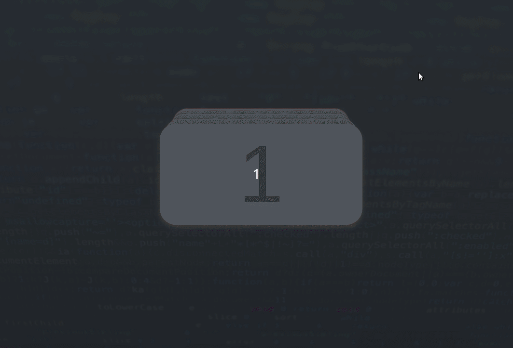

# Web-development
Web development personal projects and experiments 

# Jumping Stack of Cards
This small project uses HTML, CSS and Javascript
- Waits for a click event
- When event happens moves the first card on the stack of cards to the end of the stack

